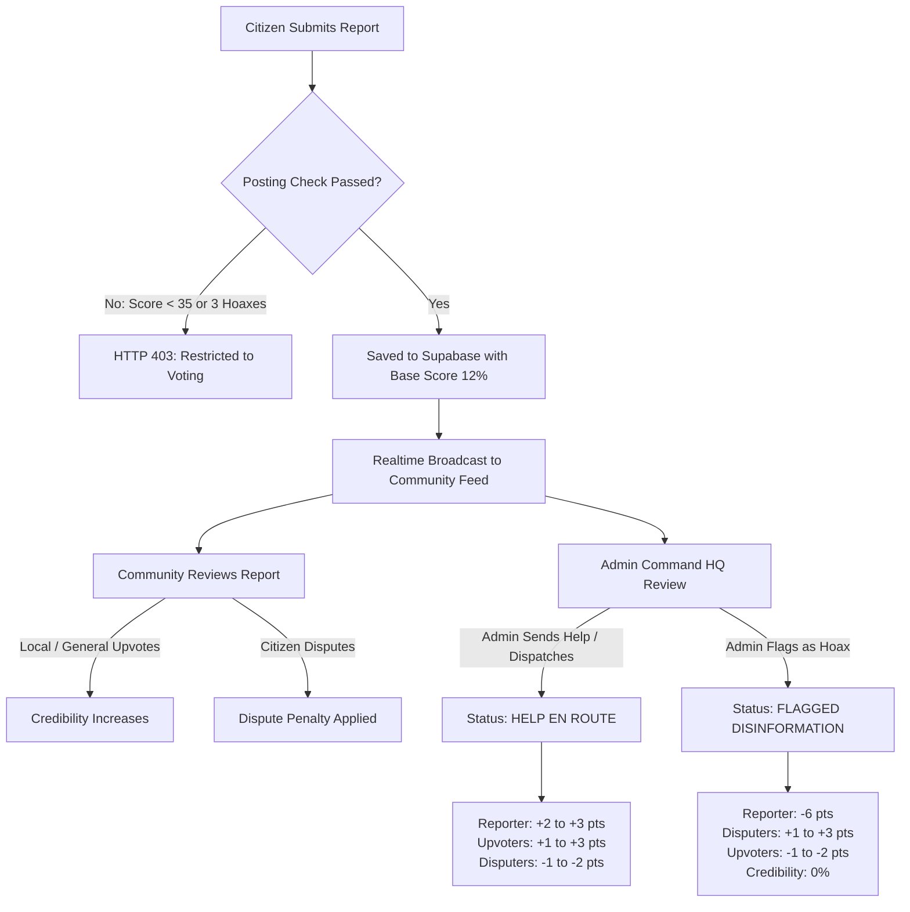
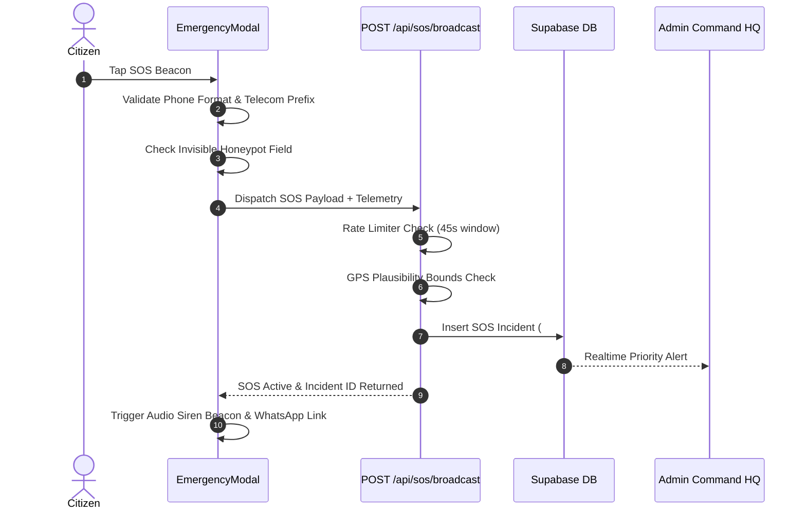

# 🚨 Tinggle — Civic Incident Ledger & Emergency Response Network

> **A real-time, decentralized civic intelligence platform connecting citizens, eyewitnesses, and municipal emergency dispatchers through verified telemetry and mathematical credibility engines.**

[](https://nextjs.org/)
[](https://react.dev/)
[](https://supabase.com/)
[](https://clerk.com/)
[](https://tailwindcss.com/)
[](LICENSE)

---

## 📑 Table of Contents

1. [System Overview](#-system-overview)
2. [Key Innovations & Core Features](#-key-innovations--core-features)
3. [Technology Stack](#-technology-stack)
4. [Architecture & Workflow Diagrams](#-architecture--workflow-diagrams)
5. [The Tinggle Credibility & Reputation Engine](#-the-tinggle-credibility--reputation-engine)
   - [Incident Trust Score (0% – 100%)](#1-incident-trust-score-0--100)
   - [Citizen Reputation Index (Base 50)](#2-citizen-reputation-index-base-50)
   - [Anti-Misinformation Posting Suspension Rules](#3-anti-misinformation-posting-suspension-rules)
   - [Voter Accuracy Incentives (1 – 3 Points Scale)](#4-voter-accuracy-incentives-1--3-points-scale)
6. [Emergency SOS & Anti-Spam Telemetry Shield](#-emergency-sos--anti-spam-telemetry-shield)
7. [Comprehensive API Reference](#-comprehensive-api-reference)
   - [Incidents & Feed API](#1-incidents--feed-api)
   - [Voting & Corroboration API](#2-voting--corroboration-api)
   - [Emergency SOS API](#3-emergency-sos-api)
   - [User Profile & Reputation API](#4-user-profile--reputation-api)
   - [Phone Verification & OTP API](#5-phone-verification--otp-api)
   - [Authentication & Identity API](#6-authentication--identity-api)
   - [Watchlist & Geolocation API](#7-watchlist--geolocation-api)
8. [Database Schema & Data Models](#-database-schema--data-models)
9. [Component Hierarchy & UI Modules](#-component-hierarchy--ui-modules)
10. [Environment Variables & Setup Guide](#-environment-variables--setup-guide)
11. [Running the Application](#-running-the-application)
12. [Deployment & Production Readiness](#-deployment--production-readiness)

---

## 🌐 System Overview

**Tinggle** is a next-generation civic safety application engineered to bridge the gap between eyewitness reports on the ground and official emergency services. In traditional social networks, unvetted rumors spread unchecked while critical emergency distress signals get lost in the noise. Tinggle solves this through:

- **Mathematical Credibility Scoring**: Proximity-verified eyewitness upvotes, photographic corroboration, and municipal verification dynamically compute an alert's veracity.
- **Priority-Trained Civic Feed**: Active, ongoing emergencies and squad-dispatched alerts sit at the top; resolved issues and debunked hoaxes automatically sink to the bottom.
- **Zero-Delay SOS with Telemetry Shielding**: Instant panic beacons transmit GPS telemetry, phone validation, and anti-bot checks without delaying victims with SMS OTP hurdles.
- **Admin Command HQ**: Dedicated municipal dashboard with active threat mapping, inter-agency squad dispatch (Fire, Police, Ambulance, HazMat), and editorial hoax moderation.
- **Live Search & Archive Radar**: Real-time auto-complete suggestions and an interactive search page with category, status, and proximity filtering.

---

## ✨ Key Innovations & Core Features

### 1. Citizen Intelligence Feed
- **Proximity-Based Sorting**: Uses the Haversine formula to detect if an incident is near the user's current GPS coordinates (`📍 NEAR YOU`).
- **Neighborhood Watchlist**: Users can pin specific sectors/neighborhoods to receive highlighted priority badges (`⭐ WATCHLIST`).
- **Supabase Realtime Sync**: Instantly prepends new alerts, updates upvote/dispute counters, and reflects status changes across all clients without page reloads.
- **Help Dispatched Visuals**: Incidents with active municipal response units display glowing `🚑 HELP DISPATCHED · SQUAD EN ROUTE` badges.

### 2. Dual Map & Feed Modes
- **Feed View**: Compact, informative dossier cards with credibility progress meters, photos, and quick upvote/flag actions.
- **Live Incident Map**: Interactive Leaflet-powered GIS radar with custom dark-mode styling, live radius circles, danger threat sectors, and category-themed markers.

### 3. Emergency SOS Panic Beacon
- **Persistent Floating SOS Button**: Accessible from any citizen view (safely disabled on Admin HQ views).
- **Audio Siren Beacon**: Built-in Web Audio API synthesizes emergency alternating alarm frequencies (750 Hz ↔ 1050 Hz) for on-scene attention.
- **One-Tap Speed Dials**: Instant emergency integration for `112` (Police/General) and `108` (Ambulance).
- **Live WhatsApp Location Dispatch**: Generates pre-formatted emergency dispatch links with Google Maps latitude/longitude coordinates.
- **Self-Resolution Protocol**: When citizens confirm their safety, they can resolve the SOS alert, archiving it to admin history and freeing public frequency.

### 4. Admin Command HQ (`/admin`)
- **Triage Center**: Real-time incident categorization across active alerts, SOS beacons, and closed archives.
- **Squad Dispatch Engine**: Dispatches specific municipal units (e.g., *Fire & HazMat Squad*, *Traffic Patrol Division*, *EMS Trauma Team*, *Disaster Task Force*).
- **Anti-Disinformation Moderation**: Marks false alarms with an official `FLAGGED AS HOAX` label, dropping incident trust to 0% and issuing penalties to malicious actors.

### 5. Interactive Header Search & Dedicated Archive (`/search`)
- **Header Search with Live Suggestions**: Floating auto-complete dropdown suggests matches by title, category, location, or ID, highlighting dispatched and resolved statuses.
- **Dedicated Archive Explorer**: Full-page search with filters for Category, Status (*Active*, *Help Dispatched*, *Solved*, *Hoax*), and multi-criteria sorting (*Relevance*, *Newest*, *Trust Score*, *Upvotes*).

---

## 🛠 Technology Stack

| Layer | Technology | Purpose |
| :--- | :--- | :--- |
| **Framework** | [Next.js 16.3.6 (Turbopack)](https://nextjs.org/) | App Router, Server Actions, API routes, and SSR/SSG optimization |
| **UI Library** | [React 19.2.8](https://react.dev/) | Component architecture, state transitions, and hooks |
| **Styling** | [Tailwind CSS v4](https://tailwindcss.com/) | Custom design tokens, dark glassmorphism, responsive utilities |
| **Database** | [Supabase (PostgreSQL)](https://supabase.com/) | Relational database, JSON metadata, and Realtime PostgreSQL replication |
| **Authentication** | [Clerk](https://clerk.com/) | Secure user identity, social logins, session management, and auth tokens |
| **GIS & Mapping** | [Leaflet](https://leafletjs.com/) & [React-Leaflet](https://react-leaflet.js.org/) | Interactive spatial maps, custom markers, radar circles, and geolocation |
| **Icons & Motion** | [Lucide React](https://lucide.dev/) & [Framer Motion](https://www.framer.com/motion/) | Iconography and micro-animations |
| **Security** | [bcryptjs](https://github.com/dcodeIO/bcrypt.js) | Cryptographic password hashing for fallback local authentication |

---

## 🏛 Architecture & Workflow Diagrams

### 1. Incident Corroboration & Credibility Lifecycle



### 2. Emergency SOS Telemetry Shield



---

## 🧮 The Tinggle Credibility & Reputation Engine

The engine is located in [`lib/credibility.lib.js`](file:///d:/Bit/and/Build_OD_Techbies/tinggle/lib/credibility.lib.js).

### 1. Incident Trust Score (0% – 100%)

Calculated deterministically based on real-world evidence:
$$\text{Score} = \text{Base (12\%)} + \text{General Upvotes} + \text{Local Eyewitness Corroboration} + \text{Photo Proof} + \text{Official Dispatch} - \text{Disputes}$$

- **Base Score**: `+12%` initial uncorroborated trust.
- **General Upvotes**: `+2.5%` per remote upvote (capped at `+20%`).
- **Local Eyewitness Upvotes**: `+8%` per verified local eyewitness within 6 km of the scene (capped at `+32%`).
- **Photographic Evidence**: `+8%` when photo proof is attached.
- **Official Dispatch / Verification**: `+18%` when municipal teams are deployed.
- **Citizen Dispute Penalty**: `-20%` per citizen dispute (capped at `-60%`).
- **Debunked Hoax Override**: Immediately forced to `0%` if flagged by Admin Command HQ.

#### Trust Tiers:
- **`80% – 100%`**: High Civic Trust · Corroborated (Emerald)
- **`55% – 79%`**: Verified Community Alert (Sky Blue)
- **`30% – 54%`**: Active Community Review (Amber)
- **`5% – 29%`**: Low Corroboration / Unverified (Zinc)
- **`0%`**: DEBUNKED / FAKE NEWS (Red)

---

### 2. Citizen Reputation Index (Base 50)

Every registered user maintains a reputation score between **0 and 100**:

- **Baseline Score**: `50 points` for all newly registered accounts.
- **Pending Reports**: Upvotes on unadjudicated alerts **do not** inflate scores, eliminating upvote-farming and brigade manipulation.
- **Successful Genuine Report**:
  - Admin Dispatched / Squad En Route: **`+2 points`**
  - Officially Contained / Resolved: **`+3 points`**
- **False Report / Hoax**:
  - Admin Flags as Fake / Disinformation: **`-6 points` deduction** (calibrated within the 5–7 point penalty window).

#### Reputation Tiers:
- **`80 – 100`**: Civic Vanguard (Elite Citizen)
- **`65 – 79`**: Trusted Eyewitness
- **`50 – 64`**: Active Citizen
- **`35 – 49`**: Probationary Citizen
- **`< 35`**: Restricted / Voting Only Mode

---

### 3. Anti-Misinformation Posting Suspension Rules

Implemented in [`checkPostingPrivilege`](file:///d:/Bit/and/Build_OD_Techbies/tinggle/lib/credibility.lib.js):

A citizen is automatically **prohibited from posting new incident reports** if:
1. Their credibility score drops below **`35 points`**, OR
2. Their **last 3 consecutive reports** were flagged as hoaxes/false alarms by Admin Command HQ.

**Restriction Enforcement**:
- `POST /api/incidents` responds with HTTP `403 Forbidden` (`{ isRestricted: true }`).
- The reporting form displays an alert banner explaining the suspension and disables the submission button.
- **Rebuilding Trust**: Restricted users can still browse and vote on ongoing incidents. Accurate upvotes and dispute flags reward reputation points until their score exceeds 35.

---

### 4. Voter Accuracy Incentives (1 – 3 Points Scale)

When an incident is evaluated by municipal authorities, participating voters are rewarded or penalized:

| Incident Outcome | Citizen Action | Score Impact | Rationale |
| :--- | :--- | :--- | :--- |
| **Confirmed Genuine** | Upvoted (Real) | **`+1 to +3 points`** | Correctly corroborated an authentic civic event |
| **Confirmed Genuine** | Disputed (Fake) | **`-1 to -2 points`** | False dispute obstructed a genuine emergency |
| **Confirmed Hoax** | Disputed (Fake) | **`+1 to +3 points`** | Vigilant citizen prevented community misinformation |
| **Confirmed Hoax** | Upvoted (Real) | **`-1 to -2 points`** | Amplified false alerts and fabricated claims |

**Scoring Weight Factors (1–3 Scale)**:
1. **Category Severity**: Disaster / Medical / Fire / SOS (`3 pts`) vs Crime / Traffic / Utility (`2 pts`) vs Transit (`1 pt`).
2. **Local Proximity**: Verified on-scene eyewitnesses (`is_local === true`) receive boosted impact up to 3 points.
3. **Consensus Factor**: Incidents with high community participation (5+ votes) scale up to 3 points.

---

## 🛡 Emergency SOS & Anti-Spam Telemetry Shield

In genuine life-threatening emergencies, **citizens must not be delayed waiting for SMS OTP codes**. To balance instantaneous dispatch with anti-spam protection, Tinggle implements a multi-layer telemetry shield:

1. **E.164 Telecom Validation (`lib/phone-validation.lib.js`)**:
   - Enforces 10–15 digit phone standards (e.g., 10 digits starting with 6–9 for Indian telecom).
   - Rejects repeating digits (`0000000000`, `9999999999`).
   - Rejects sequential numbers (`1234567890`, `9876543210`).
   - Rejects numbers with fewer than 4 unique digits.
2. **Invisible DOM Honeypot**:
   - An invisible field (`phone_verification_honeypot`) traps automated scrapers and bots. Submissions with this field filled are rejected immediately.
3. **In-Memory Rate Limiting (45s Cooldown)**:
   - Prevents flooded requests from the same IP/fingerprint within 45 seconds (returns HTTP `429 Too Many Requests`).
4. **GPS Plausibility Bounds**:
   - Validates that coordinates fall within valid geographic bounds (`lat` -90 to 90, `lng` -180 to 180).
5. **Telemetric Shield Stamp**:
   - Dispatches include `[SHIELD: TELEMETRY VERIFIED · ANTI-SPAM PASSED]` and note whether the caller is an anonymous or registered user.

---

## 📡 Comprehensive API Reference

### 1. Incidents & Feed API

#### `GET /api/incidents`
Returns a list of incident reports sorted by creation time.
- **Query Parameters**:
  - `category` (optional): Filter by category (`Traffic`, `Fire`, `Utility`, `Public Safety`, `Transit`, `Medical`, `Disaster`).
  - `status` (optional): Filter by operational status.
  - `limit` (optional): Number of records to return (default: `50`).
- **Response**:
  ```json
  {
    "success": true,
    "total": 42,
    "data": [
      {
        "id": "INC-74829",
        "title": "Water Main Rupture on Main St",
        "category": "Utility",
        "status": "HELP EN ROUTE · DISPATCHED",
        "location_text": "Main St, Sector 4",
        "latitude": 20.2961,
        "longitude": 85.8245,
        "confirm_count": 14,
        "dispute_count": 0,
        "trust_score": "CIVIC TRUST: 82% (High Civic Trust · Corroborated)",
        "created_at": "2026-09-27T04:15:00.000Z"
      }
    ]
  }
  ```

#### `POST /api/incidents`
Submits a citizen incident report. Requires authentication and passing posting privilege checks.
- **Headers**: `Content-Type: application/json`, `x-api-key: <api_key>`
- **Request Body**:
  ```json
  {
    "title": "Gas Leak Detected near Market",
    "description": "Strong gas odor observed near commercial kitchen exit.",
    "category": "Fire",
    "location_text": "Bhubaneswar Market Building",
    "latitude": 20.29606,
    "longitude": 85.82454,
    "image_url": "data:image/jpeg;base64,...",
    "is_anonymous": false,
    "reporter_email": "citizen@example.com"
  }
  ```
- **Error Responses**:
  - `401 Unauthorized`: Missing or invalid user identity.
  - `403 Forbidden`: User reputation < 35 or last 3 reports were hoaxes.

#### `PATCH /api/incidents`
Admin endpoint to update status, assign emergency squads, or mark an incident as a hoax. Synchronizes reputation scores for the author and all participating voters.
- **Headers**: `Authorization: Bearer <api_key>`, `x-api-key: <api_key>`
- **Request Body**:
  ```json
  {
    "id": "INC-74829",
    "status": "HELP EN ROUTE · DISPATCHED",
    "trust_score": "Fire & HazMat Squad Dispatched"
  }
  ```

#### `DELETE /api/incidents?id=<incident_id>`
Admin endpoint to permanently delete an invalid or test record.

#### `GET /api/incidents/[id]`
Returns the full dossier for a specific incident.

---

### 2. Voting & Corroboration API

#### `GET /api/incidents/[id]/vote?email=<user_email>`
Checks whether the current user has already cast a vote on this incident.
- **Response**: `{ "success": true, "hasVoted": true, "voteType": "upvote", "isLocal": true }`

#### `POST /api/incidents/[id]/vote`
Casts an upvote or dispute flag on an incident.
- **Request Body**:
  ```json
  {
    "userEmail": "citizen@example.com",
    "userLat": 20.2965,
    "userLng": 85.8249,
    "voteType": "upvote" // "upvote" | "dispute" | "fake"
  }
  ```
- **Constraints**:
  - Authors cannot upvote their own reports.
  - One vote per user per incident (prevented by unique composite constraints).
  - Automatically assesses proximity using GPS coordinates.

---

### 3. Emergency SOS API

#### `POST /api/sos/broadcast`
Broadcasts a priority emergency SOS alert to authorities and nearby citizens.
- **Request Body**:
  ```json
  {
    "emergencyType": "Medical", // "Medical" | "Crime" | "Fire" | "Disaster"
    "contactPhone": "+919876543210",
    "latitude": 20.2961,
    "longitude": 85.8245,
    "locationText": "GPS: 20.2961, 85.8245 (±12m)",
    "details": "Trapped in room, severe bleeding",
    "reporterEmail": "caller@example.com",
    "reporterName": "John Doe",
    "phone_verification_honeypot": "" // Honeypot must be empty
  }
  ```

#### `POST /api/sos/resolve`
Marks an active SOS beacon as resolved when the caller is safe.
- **Request Body**: `{ "incidentId": "SOS-10492" }`

---

### 4. User Profile & Reputation API

#### `GET /api/user/profile?email=<user_email>`
Returns full citizen reputation analytics, calculated metrics, posting privileges, and filed reports.
- **Response**:
  ```json
  {
    "success": true,
    "user": {
      "id": 1,
      "email": "citizen@example.com",
      "displayName": "John Doe",
      "reputation": 56,
      "tier": "ACTIVE CITIZEN",
      "tierBadge": "Active Citizen",
      "tierColor": "#f59e0b",
      "postingPrivilege": { "canPost": true, "reason": null },
      "watchlist": ["Nayapalli", "Saheed Nagar"]
    },
    "credibility": {
      "score": 56,
      "breakdown": {
        "baseScore": 50,
        "resolutionBonus": 6,
        "voterBonus": 2,
        "voterPenalties": 0,
        "disinformationPenalties": 0
      }
    }
  }
  ```

---

### 5. Phone Verification & OTP API

#### `GET /api/user/phone?email=<user_email>`
Fetches saved emergency phone number and verification status.

#### `POST /api/user/phone`
Updates the user's phone number after passing format validation checks.

#### `POST /api/user/phone/otp`
Two-step OTP verification engine for user profiles.
- **Action 1: Send OTP**:
  ```json
  { "action": "send_otp", "phone": "9876543210", "email": "citizen@example.com" }
  ```
  Generates a 6-digit OTP cached for 5 minutes with a 45s resend cooldown. Returns `demoCode` for dev environments.
- **Action 2: Verify OTP**:
  ```json
  { "action": "verify_otp", "phone": "9876543210", "email": "citizen@example.com", "code": "482910" }
  ```
  Validates code and marks `phone_verified: true`.

---

### 6. Authentication & Identity API

#### `GET /api/auth/me?email=<user_email>`
Returns user role and administrative authorization status (`is_admin: true/false`).

#### `POST /api/auth/sync-user`
Internal hook syncing Clerk authenticated identities with the PostgreSQL database.

#### `POST /api/auth/register`
Creates a local database user account with baseline reputation of 50.

---

### 7. Watchlist & Geolocation API

#### `GET /api/watchlist?email=<user_email>`
Retrieves a citizen's pinned neighborhoods.

#### `POST /api/watchlist`
Saves or updates a citizen's pinned neighborhood sectors.

#### `GET /api/locations/suggest?q=<query>`
Auto-completes location queries using local landmark dictionaries.

---

## 🗄 Database Schema & Data Models

Tinggle is backed by Supabase PostgreSQL. Key tables include:

```sql
-- 1. Users Table
CREATE TABLE public.users (
  id BIGINT GENERATED BY DEFAULT AS IDENTITY PRIMARY KEY,
  email TEXT UNIQUE NOT NULL,
  display_name TEXT,
  password_hash TEXT DEFAULT 'google',
  reputation INTEGER DEFAULT 50,
  phone TEXT,
  phone_verified BOOLEAN DEFAULT FALSE,
  watchlist JSONB DEFAULT '[]'::jsonb,
  is_admin BOOLEAN DEFAULT FALSE,
  created_at TIMESTAMPTZ DEFAULT NOW(),
  updated_at TIMESTAMPTZ DEFAULT NOW()
);

-- 2. Incidents Table
CREATE TABLE public.incidents (
  id TEXT PRIMARY KEY,
  title TEXT NOT NULL,
  description TEXT,
  category TEXT NOT NULL,
  status TEXT DEFAULT 'PENDING CIVIC CONFIRMATION',
  location_text TEXT,
  latitude DOUBLE PRECISION,
  longitude DOUBLE PRECISION,
  image_url TEXT,
  is_anonymous BOOLEAN DEFAULT FALSE,
  reporter_email TEXT,
  confirm_count INTEGER DEFAULT 0,
  dispute_count INTEGER DEFAULT 0,
  trust_score TEXT DEFAULT 'COMMUNITY TRUST: VERIFYING',
  created_at TIMESTAMPTZ DEFAULT NOW(),
  updated_at TIMESTAMPTZ DEFAULT NOW()
);

-- 3. Incident Votes Table (Unique Composite Key prevents vote stuffing)
CREATE TABLE public.incident_votes (
  id BIGINT GENERATED BY DEFAULT AS IDENTITY PRIMARY KEY,
  incident_id TEXT NOT NULL REFERENCES public.incidents(id) ON DELETE CASCADE,
  voter_email TEXT NOT NULL,
  vote_type TEXT NOT NULL, -- 'upvote' | 'dispute' | 'fake'
  is_local BOOLEAN DEFAULT FALSE,
  voted_at TIMESTAMPTZ DEFAULT NOW(),
  CONSTRAINT unique_voter_per_incident UNIQUE (incident_id, voter_email)
);

-- 4. Incident Comments Table
CREATE TABLE public.incident_comments (
  id BIGINT GENERATED BY DEFAULT AS IDENTITY PRIMARY KEY,
  incident_id TEXT NOT NULL REFERENCES public.incidents(id) ON DELETE CASCADE,
  author_email TEXT NOT NULL,
  author_name TEXT,
  content TEXT NOT NULL,
  image_url TEXT,
  created_at TIMESTAMPTZ DEFAULT NOW()
);
```

---

## 🧱 Component Hierarchy & UI Modules

```
tinggle/
├── app/
│   ├── (main)/
│   │   ├── page.js                    # Civic Intelligence Feed & Live Map
│   │   ├── incident/[id]/page.js      # Incident Dossier & Discussion Room
│   │   ├── profile/page.js            # User Profile, OTP verification & Audit Matrix
│   │   ├── search/page.js             # Incident Archive & Filter Explorer
│   │   └── admin/page.js              # Admin Command HQ Dashboard
│   ├── api/                           # Full Next.js REST API endpoints
│   ├── layout.js                      # Root shell (ClerkProvider, Header, Footer)
│   └── globals.css                    # Tailwind CSS v4 & theme tokens
├── components/
│   ├── Header.jsx                     # Topbar, Search bar auto-complete & SOS trigger
│   ├── admin-command/
│   │   ├── AdminDashboardClient.jsx   # Master Admin state & triage view
│   │   ├── ActiveThreatSectorMap.jsx  # Live operational map for commanders
│   │   ├── HeroIncidentDossier.jsx    # Selected incident deep-dive dossier
│   │   └── SecondaryIncidentQueue.jsx # Fast queue for pending alerts
│   ├── citizen-portal/
│   │   ├── IncidentCard.jsx           # Feed card with Help Dispatched banner
│   │   ├── IncidentDetailView.jsx     # Detail view with photo modal & corroboration
│   │   ├── IncidentReportForm.jsx     # Report form with GPS & posting restrictions
│   │   ├── LiveIncidentMap.jsx        # Interactive Leaflet citizen map
│   │   └── SpatialRadarWidget.jsx     # Proximity scanning radar widget
│   └── emergency/
│       └── EmergencySosModal.jsx      # SOS modal, siren beacon, speed dial, shield
├── hooks/
│   └── useGeoLocation.js              # High-accuracy GPS hook with distance calculation
└── lib/
    ├── credibility.lib.js             # Credibility algorithm & reputation engine
    ├── phone-validation.lib.js        # Phone format, bot honeypot, & rate limiter
    ├── db.lib.js                      # Server-side Supabase client
    ├── supabase-browser.lib.js        # Client-side Supabase Realtime client
    └── users.lib.js                   # User lookup & database upsert utilities
```

---

## ⚙️ Environment Variables & Setup Guide

Create a `.env` file in the `tinggle/` directory:

```env
# Clerk Authentication
NEXT_PUBLIC_CLERK_PUBLISHABLE_KEY=pk_test_...
CLERK_SECRET_KEY=sk_test_...
NEXT_PUBLIC_CLERK_SIGN_IN_URL=/sign-in
NEXT_PUBLIC_CLERK_SIGN_UP_URL=/sign-up
NEXT_PUBLIC_CLERK_AFTER_SIGN_IN_URL=/
NEXT_PUBLIC_CLERK_AFTER_SIGN_UP_URL=/

# Supabase PostgreSQL Configuration
NEXT_PUBLIC_SUPABASE_URL=https://<your-project-ref>.supabase.co
NEXT_PUBLIC_SUPABASE_ANON_KEY=eyJhbGciOi...
SUPABASE_SERVICE_ROLE_KEY=eyJhbGciOi...

# Internal API Protection Key
NEXT_PUBLIC_API_KEY=tinggle-api-key-1
```

---

## 🚀 Running the Application

### 1. Clone & Install Dependencies
```bash
git clone https://github.com/xerolabs-io/Bit-N-Build-2026---Odisha-State-Techbies-.git
cd Bit-N-Build-2026---Odisha-State-Techbies-/tinggle
npm install
```

### 2. Run the Development Server
```bash
npm run dev
```
Open **[http://localhost:3000](http://localhost:3000)** in your browser.

### 3. Build for Production
```bash
npm run build
npm run start
```

---

## 🚢 Deployment & Production Readiness

- **Platform**: Fully optimized for deployment on [Vercel](https://vercel.com/) or containerized with Docker.
- **Turbopack**: Compatible with Next.js 16.3.6 Turbopack for sub-second builds.
- **Edge Compatibility**: Client-side geographic distance calculations reduce server latency.
- **Graceful Schema Fallbacks**: API routes gracefully handle absent optional schema columns (e.g. metadata fallbacks for watchlist and OTP verification states).

---

## 👥 Contributors & Hackathon Information

Developed by **Team Techbies** for **Bit-N-Build 2026 (Odisha State Edition)**.

*Empowering citizens with verifiable truth. Eliminating false alarms. Coordinating emergency rescue.*
